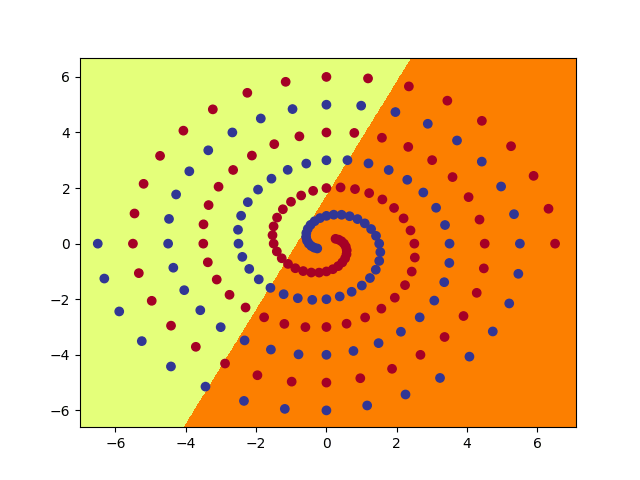
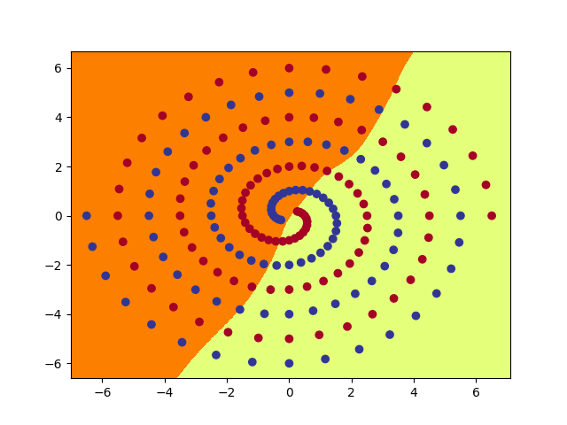
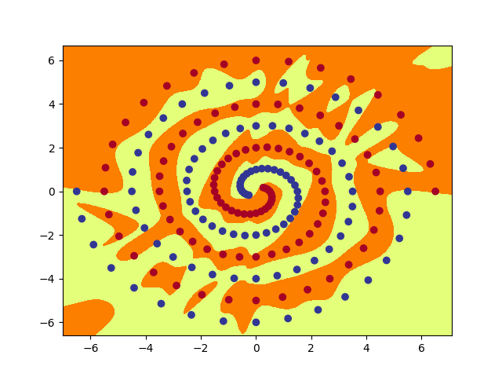

# Twin Spirals Problem

This project visually explores how the framing of a problem can dramatically affect the training performance of neural networks.

The project starts with the creation of some data points by according to the following formulae for two classes, A and B:

Class A
$$ x = r * math.cos(φ) $$
$$ y = r * math.sin(φ) $$

Class B
$$ x = -r * math.cos(φ) $$
$$ y = -r * math.sin(φ) $$

One hundred data points are created for both classes by iteratively updating both the 'r' and 'φ' parameters.
Points belonging to class A are labeled with a 1, and points belonging to class B are labeled with a 0.
After the required packages are installed, the data can be created by running the `spiral_create_data.py` script.

By graphing these points, we can see that two spirals are created, one for each class of points. The image is located in the `data_images` folder.


Let's assume that we saw this pattern in a data set naturally, and that we wish to train a neural network which will learn to classify points between the two classes.

The `RawNet` model defined in `spiral_models.py` is a simple neural network with 2 hidden layers, which takes the number of nodes in each hidden layer as defined by the user. For the purpose of illustration, we will use 20.
The model can be run by submitting the following terminal command from the project folder's directory:
```
python3 spiral_main.py --net 'raw' --hid 20
```
The `--net` flag tells the script we want to use the `RawNet` model, and the `--hid` flag tells the script to create the model with 20 nodes in each of the 2 hidden layers.

The terminal will show the training status of the model:
```
ep:  100 loss: 0.1597 acc: 54.00
ep:  200 loss: 0.0815 acc: 54.50
ep:  300 loss: 0.0316 acc: 53.00
ep:  400 loss: 0.0153 acc: 53.50
```
After several thousand epochs, the training accuracy will reach 100%, and 3 images will be created in the `images` folder.



